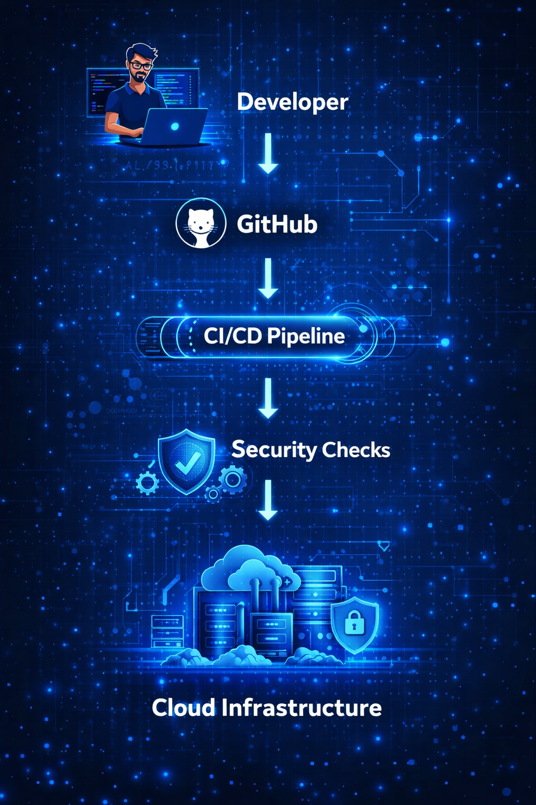
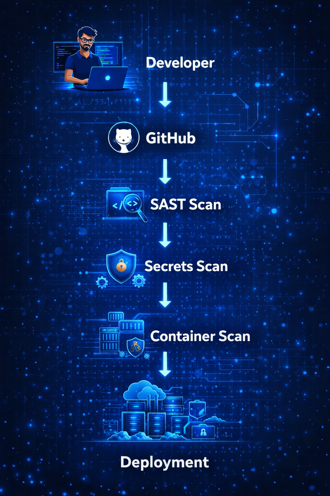
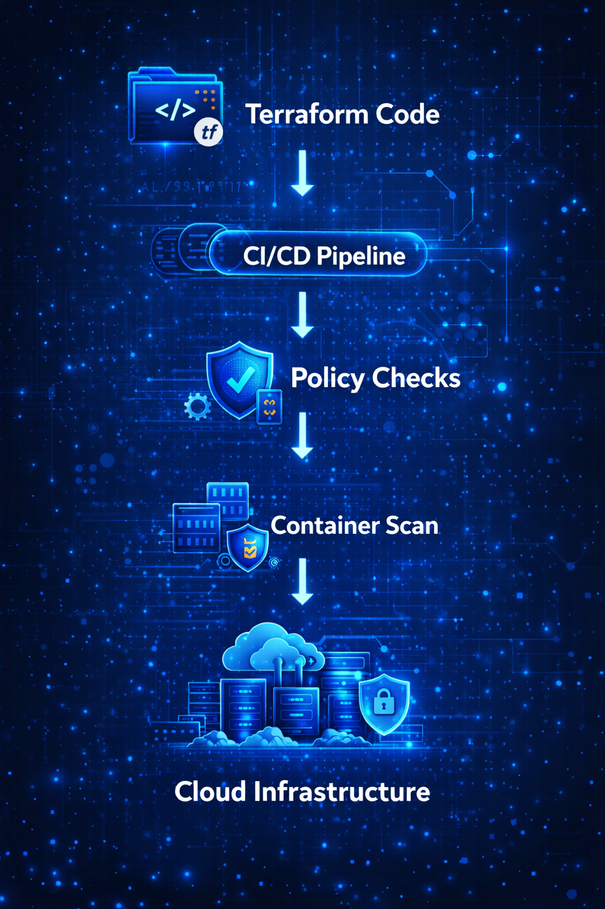
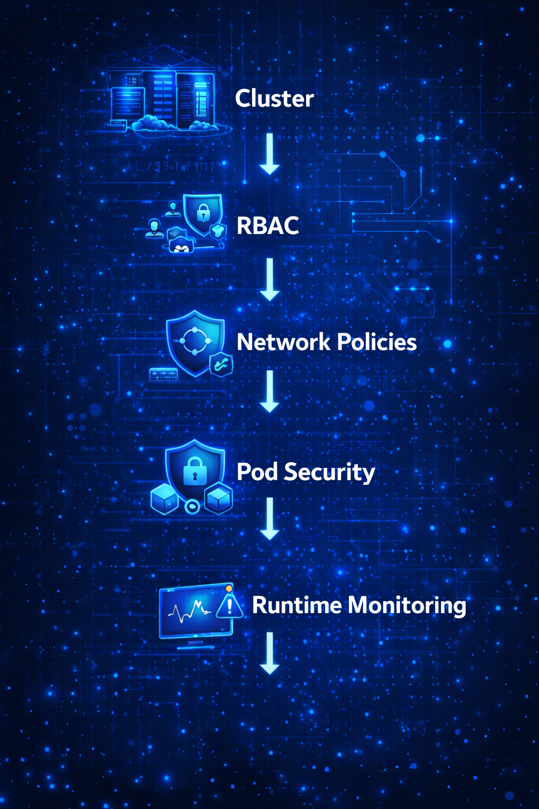
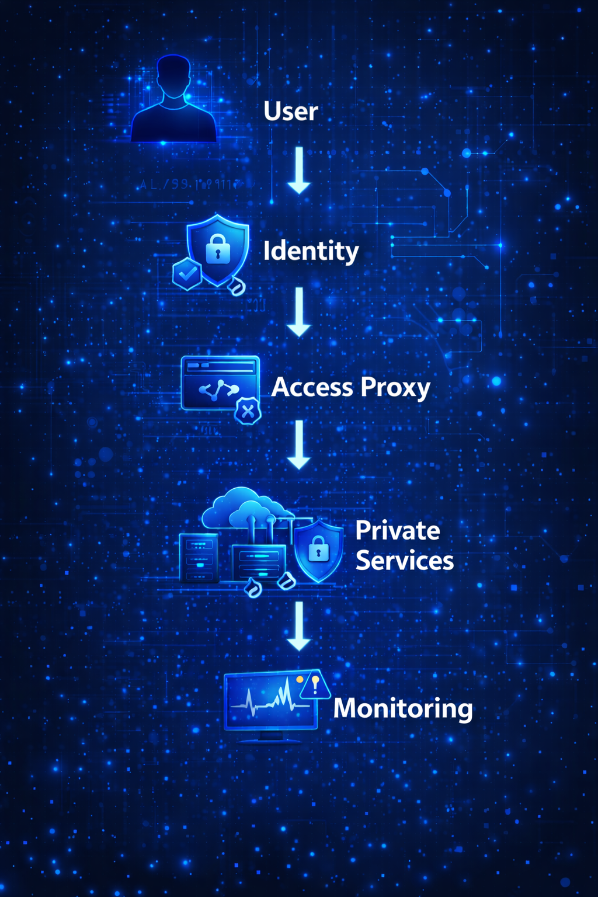

# Hi, I'm Vijay 👋

Cloud Security Architect focused on building secure cloud platforms, DevSecOps pipelines, and AI-enabled systems across modern cloud environments.

I work at the intersection of **cloud security, platform engineering, and AI security**, designing architectures that help organizations scale infrastructure while protecting identity, data, and workloads.

---

## 🔐 Areas I Focus On

Cloud Security Architecture  
DevSecOps and Secure CI/CD  
Terraform and Infrastructure as Code  
Kubernetes and Container Security  
AI / GenAI Security Architecture  
Multi-Cloud Platforms (GCP • AWS • Azure)

---

## 📂 Featured Repositories

### GenAI Cloud Security Patterns
Security considerations and architecture ideas for **LLM systems, RAG architectures, and AI workloads**.

Repo →  
https://github.com/vjaiii/genai-cloud-security-patterns

---

### Terraform Cloud Security Blueprints
Reference Terraform structures for building **secure cloud foundations across GCP, AWS, and Azure**.

Repo →  
https://github.com/vjaiii/terraform-cloud-security-blueprints

---

### DevSecOps Security Pipeline Patterns
Secure CI/CD workflows integrating:

• SAST  
• secrets scanning  
• container security  
• infrastructure scanning  
• policy validation  

Repo →  
https://github.com/vjaiii/devsecops-security-pipeline-patterns

---

### Kubernetes Security Hardening Guide
Practical guidance for:

• RBAC design  
• workload security  
• network policies  
• secrets protection  
• runtime monitoring  

Repo →  
https://github.com/vjaiii/kubernetes-security-hardening-guide

---

### Cloud Security Architecture Patterns
Architecture notes and design ideas for **secure enterprise cloud platforms**.

Repo →  
https://github.com/vjaiii/cloud-security-architecture-patterns

---

### Cloud Incident Response Playbooks
Response playbooks for cloud incidents including:

• IAM compromise  
• suspicious API activity  
• data exposure scenarios  
• Kubernetes incident triage  

Repo →  
https://github.com/vjaiii/cloud-incident-response-playbooks

---

## 🧠 Topics I’m Currently Exploring

GenAI security architectures  
Secure RAG systems  
Cloud platform guardrails  
Zero-Trust cloud architectures  
Security automation in DevSecOps pipelines

---

## ⚙️ Technology Stack

### Cloud Platforms
GCP • AWS • Azure

### Infrastructure
Terraform • Kubernetes • Docker

### Security
IAM • Network Security • DevSecOps • Runtime Security • Cloud Governance

---

## 🌐 Connect With Me

LinkedIn  
https://www.linkedin.com/in/vijay-kumar-385b27219/

GitHub  
https://github.com/vjaiii

## Cloud Security Architecture Patterns

Below are some architecture patterns and security workflows I frequently work with across cloud environments.

---

### GenAI Security Architecture

Secure architecture considerations for LLM and AI workloads including identity, service isolation, and monitoring.

---

### DevSecOps Security Pipeline

A secure CI/CD pipeline integrating static analysis, secrets scanning, container security, and controlled deployment.

---

### Terraform Cloud Security Architecture

Infrastructure as Code security workflow using policy checks and automated validation before infrastructure deployment.

---

### Kubernetes Security Layers

Security layers for Kubernetes environments including RBAC, network policies, pod security, and runtime monitoring.

---

### Zero Trust Cloud Architecture

Secure access design using identity-based access, proxy enforcement, private services, and monitoring.

