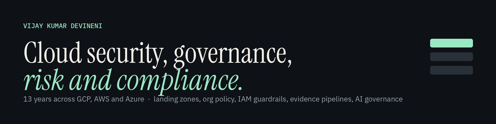

AI, Cloud and Infrastructure Security Architect - Governance, Risk and Compliance.

13 years across GCP, AWS and Azure in regulated financial services, retail, and healthcare. I build the boring parts that keep enterprises out of the news: landing zones, org policy, IAM guardrails, evidence pipelines, and the governance that makes AI workloads auditable. Most of what I publish here is reference material I wish had existed when I needed it.

## Focus

**Cloud GRC as code.** Controls mapped to NIST 800-53, ISO 27001, SOC 2, HIPAA and PCI DSS, implemented as policy and Terraform rather than spreadsheets.

**AI governance.** NIST AI RMF, ISO 42001, EU AI Act readiness, and security for LLM, RAG and agent (MCP) workloads.

**Secure platform foundations.** GCP landing zones on Cloud Foundation Fabric, DevSecOps pipelines, Kubernetes hardening.

**Architecture review boards.** TRB and ARB governance, exception handling, and the tooling behind them.

## Repositories

| Repo | What it is |
|---|---|
| [cloud-grc-control-library](https://github.com/vjaiii/cloud-grc-control-library)  | 27 machine-readable controls mapped across NIST, ISO, SOC 2, HIPAA, PCI and CIS, with OPA policies, Terraform gates and evidence collectors for GCP, AWS and Azure |
| [terraform-cloud-security-blueprints](https://github.com/vjaiii/terraform-cloud-security-blueprints) | Reference Terraform for secure cloud foundations across GCP, AWS and Azure |
| [devsecops-security-pipeline-patterns](https://github.com/vjaiii/devsecops-security-pipeline-patterns) | CI/CD reference patterns with SAST, secrets, IaC and container scanning and policy gates |
| [cloud-incident-response-playbooks](https://github.com/vjaiii/cloud-incident-response-playbooks) | Runbooks for cloud, IAM, Kubernetes and data exposure incidents |
| [genai-cloud-security-patterns](https://github.com/vjaiii/genai-cloud-security-patterns) | Security patterns for GenAI and LLM workloads across the three clouds |
| [kubernetes-security-hardening-guide](https://github.com/vjaiii/kubernetes-security-hardening-guide) | Workload protection, access control and runtime hardening for Kubernetes |

Next up: an AI governance toolkit - intake, risk tiering and agent security review mapped to NIST AI RMF and ISO 42001.

## Writing

Short-form on [LinkedIn](https://www.linkedin.com/in/vijay-kumar-385b27219/), long-form on [Medium](https://medium.com/@vjaiii).
